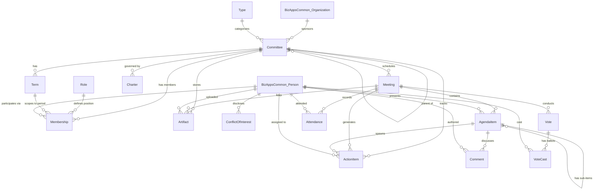

# Committees Application: Comprehensive Design Document

**Version:** 2.0
**Date:** February 15, 2026
**Status:** Active Development

---

## Table of Contents

1. [Executive Summary](#executive-summary)
2. [Business Context](#business-context)
3. [Market Positioning](#market-positioning)
4. [Architecture Overview](#architecture-overview)
5. [Data Model](#data-model)
6. [MemberJunction Infrastructure](#memberjunction-infrastructure)
7. [Integration Architecture](#integration-architecture)
8. [Feature Specifications](#feature-specifications)
9. [Implementation Phases](#implementation-phases)
10. [User Experience Design](#user-experience-design)
11. [Security & Compliance](#security-compliance)
12. [Success Metrics](#success-metrics)

---

## Executive Summary

### What We're Building

A **world-class committee management platform** purpose-built for professional associations, standards development organizations, and nonprofits with complex governance structures. Unlike corporate board tools adapted for associations, we're designing association-first with seamless integration into existing workflows.

### Market Opportunity

**$500M+ addressable market** with 70%+ growth since 2020. Current solutions are either:
- Too simple (Boardable: $25-44/month, limited features)
- Too corporate-focused (Diligent/BoardEffect: $300-400/month, wrong features)
- Afterthoughts in AMS platforms (poor UX, limited functionality)

**Our positioning:** Association-first platform with enterprise features at accessible pricing ($199-999/month based on committee count, unlimited users).

### Technical Foundation

Built on **MemberJunction 5.0** platform with:
- **BizApps Common** dependency for Person/Organization entities
- **OpenApp** packaging for easy installation and upgrades
- **AI-powered** features leveraging MJ's multi-LLM framework
- **MJ infrastructure** for security, notifications, RBAC, encryption

### Key Differentiators

1. **Association-specific workflows** - Elections, standards development, succession planning
2. **Integration excellence** - Google Workspace, Microsoft 365, Box.com, AMS platforms
3. **AI without complexity** - Automated minutes, engagement scoring, smart suggestions
4. **Transparent pricing** - Published rates, unlimited users, no hidden fees

---

## Business Context

### The Problem

Organizations manage committees through fragmented tools:
- **Spreadsheets** for rosters and terms
- **Email threads** for coordination
- **Shared drives** with inconsistent structure
- **Calendar apps** disconnected from membership data
- **Word documents** for agendas/minutes in silos

**Result:** Lost institutional knowledge, missed action items, compliance difficulties, hours of administrative overhead.

### Target Personas

#### 1. Board Administrator (Sarah)
- Manages 15+ committees
- Annual elections and term transitions
- Compliance reporting for auditors
- **Pain:** 500+ row spreadsheet tracking all memberships

#### 2. Committee Chair (Michael)
- Leads 12-member standing committee
- Monthly meetings with detailed agendas
- Assigns and follows up on action items
- **Pain:** 3+ hours per meeting on administrative tasks

#### 3. Committee Member (Jennifer)
- Serves on 3 different committees
- Tracks action items across all
- Reviews documents before meetings
- **Pain:** Can't remember which committee assigned which task

#### 4. Standards Development Lead (Technical orgs)
- Manages working groups drafting specifications
- Tracks ballot votes and comment periods
- Coordinates 10-50 members from different companies
- **Pain:** Manual ballot management, comment tracking chaos

### Success Criteria

**User Adoption:**
- 90%+ of committee members actively using platform
- 75%+ reduction in administrative time for chairs
- 95%+ meeting attendance tracking accuracy
- Zero lost action items

**Business Metrics:**
- $199-999/month pricing tiers based on committee count
- 3-5 committees average per customer
- <10% annual churn rate
- 40+ NPS score

---

## Market Positioning

### Competitive Landscape

| Category | Example | Strength | Weakness | Our Advantage |
|----------|---------|----------|----------|---------------|
| **Entry-Level** | Boardable | Easy to use, $25-44/mo | Limited features | Beat on association-specific workflows |
| **Enterprise Board** | Diligent, BoardEffect | Comprehensive features | $300-400/mo, corporate-focused | Better usability, 1/3 the price, association features |
| **AMS Platforms** | Fonteva, Nimble AMS | Already own, CRM integration | Committees afterthought, poor UX | Purpose-built, integrate with their AMS |
| **Standards Tools** | IEEE eTools, ANSI Connect | Standards workflows | Dated UX, siloed | Modern UX, broader use cases |

### Target Market Priority

**1. Professional Associations (60% focus)**
- Medical, legal, engineering associations
- Standards development organizations (IEEE, ANSI participants)
- Trade associations with 10+ committees

**2. Nonprofit Boards (30% focus)**
- Nonprofits with multiple active committees
- Foundations with governance requirements
- Educational institutions

**3. Mid-Market Corporate (10% focus)**
- Private companies with board governance needs
- Family businesses with advisory boards
- Professional services firms

### Pricing Strategy

**Per-Organization Tiers (Unlimited Users):**

| Tier | Price/Month | Committees | Storage | Features | Support |
|------|-------------|------------|---------|----------|---------|
| **Starter** | $199 | Up to 3 | 100GB | All Phase 1 | Email |
| **Professional** | $499 | Up to 10 | 500GB | + AI features | Priority |
| **Enterprise** | $999 | Unlimited | Unlimited | + Elections, Standards | Dedicated AM |

**Add-Ons:**
- Election Management: +$99/month (during election periods only)
- Advanced Analytics: +$199/month
- AMS Integration: +$299 setup + $99/month

**Nonprofit Discount:** 20% automatic (no application)

**Why this works:**
- Unlimited users encourages inclusive governance
- Tiered by committee count (proxy for org size)
- Significantly cheaper than enterprise competitors
- Published pricing reduces friction

---

## Architecture Overview

### Technology Stack

**Backend:**
- TypeScript/Node.js
- GraphQL (Apollo Server) via MJ
- SQL Server database
- MemberJunction 5.0 framework

**Frontend:**
- Angular 18
- MemberJunction Angular components
- Responsive web design (mobile-first)

**Dependencies:**
- `bizapps-common` repo for Person/Organization entities
- MJ platform packages (`@memberjunction/*`)
- OpenApp packaging spec for distribution

**AI/ML:**
- MJ AI Framework with multi-LLM support
- Claude 4 for minute generation
- OpenAI for embeddings and search
- Local models for privacy-sensitive operations

### Repository Structure

```
committees/
├── apps/
│   ├── MJAPI/              # GraphQL API (port 4101)
│   └── MJExplorer/         # Angular UI (port 4301)
├── packages/
│   ├── GeneratedEntities/  # CodeGen entity subclasses
│   ├── GeneratedActions/   # CodeGen action subclasses
│   ├── committees-core/    # Business logic (NEW)
│   └── ng-committees/      # Angular components (NEW)
├── migrations/
│   └── V202602150002__Committees_Schema_and_Tables.sql
├── plans/
│   ├── COMPREHENSIVE_DESIGN.md (this file)
│   ├── MARKET_RESEARCH_REPORT.md
│   └── mockups/            # UX designs (to be created)
└── metadata/               # MJ application metadata
```

### Dependency Graph

```
Committees App
  └── BizApps Common
      ├── Person
      ├── Organization
      ├── Address
      └── ContactMethod
  └── MemberJunction 5.0
      ├── Core (@memberjunction/core)
      ├── Encryption (@memberjunction/encryption)
      ├── Notifications (@memberjunction/notifications)
      ├── Communication (@memberjunction/communication-*)
      ├── AI Framework (@memberjunction/ai)
      └── Angular Components (@memberjunction/ng-*)
```

---

## Data Model

### Entity Relationship Diagram



### Core Entities

#### 1. Committee Structure

**Type** - Committee categories
```sql
CREATE TABLE __mj_Committees.Type (
    ID UNIQUEIDENTIFIER PRIMARY KEY DEFAULT NEWSEQUENTIALID(),
    Name NVARCHAR(100) NOT NULL UNIQUE,
    Description NVARCHAR(MAX),
    IsStandards BIT NOT NULL DEFAULT 0,
    DefaultTermMonths INT,
    IconClass NVARCHAR(100)
)
```

**Committee** - Core committee records
```sql
CREATE TABLE __mj_Committees.Committee (
    ID UNIQUEIDENTIFIER PRIMARY KEY DEFAULT NEWSEQUENTIALID(),
    Name NVARCHAR(255) NOT NULL,
    Description NVARCHAR(MAX),
    TypeID UNIQUEIDENTIFIER NOT NULL FK → Type,
    ParentCommitteeID UNIQUEIDENTIFIER FK → Committee (self),
    OrganizationID UNIQUEIDENTIFIER FK → __mj_BizAppsCommon.Organization,
    CharterDocumentURL NVARCHAR(1000),
    MissionStatement NVARCHAR(MAX),
    Status NVARCHAR(50) NOT NULL DEFAULT 'Active',
    IsPublic BIT NOT NULL DEFAULT 1,
    FormationDate DATE,
    DissolutionDate DATE
)
```

**Term** - Annual/custom periods
```sql
CREATE TABLE __mj_Committees.Term (
    ID UNIQUEIDENTIFIER PRIMARY KEY DEFAULT NEWSEQUENTIALID(),
    CommitteeID UNIQUEIDENTIFIER NOT NULL FK → Committee,
    Name NVARCHAR(100) NOT NULL,
    StartDate DATE NOT NULL,
    EndDate DATE,
    Status NVARCHAR(50) NOT NULL DEFAULT 'Active'
)
```

#### 2. Membership & Roles

**Role** - Chair, Vice Chair, Member, etc.
```sql
CREATE TABLE __mj_Committees.Role (
    ID UNIQUEIDENTIFIER PRIMARY KEY DEFAULT NEWSEQUENTIALID(),
    Name NVARCHAR(100) NOT NULL UNIQUE,
    Description NVARCHAR(MAX),
    IsOfficer BIT NOT NULL DEFAULT 0,
    IsVotingRole BIT NOT NULL DEFAULT 1,
    DefaultPermissionsJSON NVARCHAR(MAX),
    Sequence INT NOT NULL DEFAULT 100
)
```

**Membership** - User-committee assignments
```sql
CREATE TABLE __mj_Committees.Membership (
    ID UNIQUEIDENTIFIER PRIMARY KEY DEFAULT NEWSEQUENTIALID(),
    CommitteeID UNIQUEIDENTIFIER NOT NULL FK → Committee,
    PersonID UNIQUEIDENTIFIER NOT NULL FK → __mj_BizAppsCommon.Person,
    RoleID UNIQUEIDENTIFIER NOT NULL FK → Role,
    TermID UNIQUEIDENTIFIER FK → Term,
    StartDate DATE NOT NULL,
    EndDate DATE,
    Status NVARCHAR(50) NOT NULL DEFAULT 'Active',
    EndReason NVARCHAR(100),
    Notes NVARCHAR(MAX)
)
```

#### 3. Meeting Operations

**Meeting** - Meeting records
```sql
CREATE TABLE __mj_Committees.Meeting (
    ID UNIQUEIDENTIFIER PRIMARY KEY DEFAULT NEWSEQUENTIALID(),
    CommitteeID UNIQUEIDENTIFIER NOT NULL FK → Committee,
    Title NVARCHAR(255) NOT NULL,
    Description NVARCHAR(MAX),
    StartDateTime DATETIMEOFFSET NOT NULL,
    EndDateTime DATETIMEOFFSET,
    TimeZone NVARCHAR(50) NOT NULL DEFAULT 'America/New_York',
    LocationType NVARCHAR(50) NOT NULL DEFAULT 'Virtual',
    LocationText NVARCHAR(500),
    VideoProvider NVARCHAR(50),
    VideoMeetingID NVARCHAR(255),
    VideoJoinURL NVARCHAR(1000),
    VideoRecordingURL NVARCHAR(1000),
    TranscriptURL NVARCHAR(1000),
    Status NVARCHAR(50) NOT NULL DEFAULT 'Scheduled',
    CalendarEventID NVARCHAR(255)
)
```

**AgendaItem** - Structured agendas
```sql
CREATE TABLE __mj_Committees.AgendaItem (
    ID UNIQUEIDENTIFIER PRIMARY KEY DEFAULT NEWSEQUENTIALID(),
    MeetingID UNIQUEIDENTIFIER NOT NULL FK → Meeting,
    ParentAgendaItemID UNIQUEIDENTIFIER FK → AgendaItem (self),
    Sequence INT NOT NULL,
    Title NVARCHAR(255) NOT NULL,
    Description NVARCHAR(MAX),
    PresenterPersonID UNIQUEIDENTIFIER FK → __mj_BizAppsCommon.Person,
    DurationMinutes INT,
    ItemType NVARCHAR(50) NOT NULL DEFAULT 'Discussion',
    RelatedDocumentURL NVARCHAR(1000),
    Status NVARCHAR(50) NOT NULL DEFAULT 'Pending',
    Notes NVARCHAR(MAX)
)
```

**Attendance** - Who attended
```sql
CREATE TABLE __mj_Committees.Attendance (
    ID UNIQUEIDENTIFIER PRIMARY KEY DEFAULT NEWSEQUENTIALID(),
    MeetingID UNIQUEIDENTIFIER NOT NULL FK → Meeting,
    PersonID UNIQUEIDENTIFIER NOT NULL FK → __mj_BizAppsCommon.Person,
    AttendanceStatus NVARCHAR(50) NOT NULL DEFAULT 'Expected',
    JoinedAt DATETIMEOFFSET,
    LeftAt DATETIMEOFFSET,
    Notes NVARCHAR(500),
    UNIQUE (MeetingID, PersonID)
)
```

**Vote** - Voting records
```sql
CREATE TABLE __mj_Committees.Vote (
    ID UNIQUEIDENTIFIER PRIMARY KEY DEFAULT NEWSEQUENTIALID(),
    MeetingID UNIQUEIDENTIFIER NOT NULL FK → Meeting,
    AgendaItemID UNIQUEIDENTIFIER FK → AgendaItem,
    MotionText NVARCHAR(MAX) NOT NULL,
    VoteType NVARCHAR(50) NOT NULL, -- VoiceVote, RollCall, Secret, Unanimous
    ResultType NVARCHAR(50), -- Passed, Failed, Tabled, Withdrawn
    YesCount INT DEFAULT 0,
    NoCount INT DEFAULT 0,
    AbstainCount INT DEFAULT 0,
    QuorumMet BIT,
    VotedAt DATETIMEOFFSET
)
```

**VoteCast** - Individual ballots
```sql
CREATE TABLE __mj_Committees.VoteCast (
    ID UNIQUEIDENTIFIER PRIMARY KEY DEFAULT NEWSEQUENTIALID(),
    VoteID UNIQUEIDENTIFIER NOT NULL FK → Vote,
    PersonID UNIQUEIDENTIFIER NOT NULL FK → __mj_BizAppsCommon.Person,
    CastAs NVARCHAR(20) NOT NULL, -- Yes, No, Abstain
    CastAt DATETIMEOFFSET NOT NULL,
    UNIQUE (VoteID, PersonID)
)
```

#### 4. Action Items & Outcomes

**ActionItem** - Tasks and assignments
```sql
CREATE TABLE __mj_Committees.ActionItem (
    ID UNIQUEIDENTIFIER PRIMARY KEY DEFAULT NEWSEQUENTIALID(),
    CommitteeID UNIQUEIDENTIFIER NOT NULL FK → Committee,
    MeetingID UNIQUEIDENTIFIER FK → Meeting,
    AgendaItemID UNIQUEIDENTIFIER FK → AgendaItem,
    Title NVARCHAR(255) NOT NULL,
    Description NVARCHAR(MAX),
    AssignedToPersonID UNIQUEIDENTIFIER NOT NULL FK → __mj_BizAppsCommon.Person,
    AssignedByPersonID UNIQUEIDENTIFIER FK → __mj_BizAppsCommon.Person,
    DueDate DATE,
    Priority NVARCHAR(20) NOT NULL DEFAULT 'Medium',
    Status NVARCHAR(50) NOT NULL DEFAULT 'Open',
    CompletedAt DATETIMEOFFSET,
    CompletionNotes NVARCHAR(MAX)
)
```

**Artifact** - Document links
```sql
CREATE TABLE __mj_Committees.Artifact (
    ID UNIQUEIDENTIFIER PRIMARY KEY DEFAULT NEWSEQUENTIALID(),
    CommitteeID UNIQUEIDENTIFIER FK → Committee,
    MeetingID UNIQUEIDENTIFIER FK → Meeting,
    AgendaItemID UNIQUEIDENTIFIER FK → AgendaItem,
    ActionItemID UNIQUEIDENTIFIER FK → ActionItem,
    Title NVARCHAR(255) NOT NULL,
    Description NVARCHAR(MAX),
    Provider NVARCHAR(50) NOT NULL, -- GoogleDrive, SharePoint, Box, OneDrive, URL
    ExternalID NVARCHAR(500),
    URL NVARCHAR(2000) NOT NULL,
    MimeType NVARCHAR(100),
    FileSize BIGINT,
    UploadedByPersonID UNIQUEIDENTIFIER FK → __mj_BizAppsCommon.Person,
    ArtifactType NVARCHAR(50) NOT NULL DEFAULT 'Document'
)
```

#### 5. Collaboration

**Comment** - Threaded discussions
```sql
CREATE TABLE __mj_Committees.Comment (
    ID UNIQUEIDENTIFIER PRIMARY KEY DEFAULT NEWSEQUENTIALID(),
    EntityID UNIQUEIDENTIFIER NOT NULL FK → __mj.Entity,
    RecordID NVARCHAR(700) NOT NULL, -- Polymorphic: AgendaItem, ActionItem, etc.
    PersonID UNIQUEIDENTIFIER NOT NULL FK → __mj_BizAppsCommon.Person,
    ParentCommentID UNIQUEIDENTIFIER FK → Comment (self),
    CommentText NVARCHAR(MAX) NOT NULL,
    MentionedPersonIDs NVARCHAR(MAX), -- JSON array for @mentions
    IsResolved BIT NOT NULL DEFAULT 0
)
```

#### 6. Governance (Phase 3)

**Charter** - Committee charters
```sql
CREATE TABLE __mj_Committees.Charter (
    ID UNIQUEIDENTIFIER PRIMARY KEY DEFAULT NEWSEQUENTIALID(),
    CommitteeID UNIQUEIDENTIFIER NOT NULL FK → Committee,
    Version INT NOT NULL DEFAULT 1,
    Purpose NVARCHAR(MAX),
    Authority NVARCHAR(MAX),
    Responsibilities NVARCHAR(MAX),
    MeetingSchedule NVARCHAR(500),
    Size INT,
    TermLengthMonths INT,
    MaxConsecutiveTerms INT,
    CompetenciesRequired NVARCHAR(MAX), -- JSON
    ApprovedByPersonID UNIQUEIDENTIFIER FK → __mj_BizAppsCommon.Person,
    ApprovedAt DATETIMEOFFSET,
    EffectiveDate DATE,
    NextReviewDate DATE,
    Status NVARCHAR(50) NOT NULL DEFAULT 'Draft'
)
```

**ConflictOfInterest** - Annual disclosures
```sql
CREATE TABLE __mj_Committees.ConflictOfInterest (
    ID UNIQUEIDENTIFIER PRIMARY KEY DEFAULT NEWSEQUENTIALID(),
    PersonID UNIQUEIDENTIFIER NOT NULL FK → __mj_BizAppsCommon.Person,
    DisclosureYear INT NOT NULL,
    EntityName NVARCHAR(255),
    RelationshipType NVARCHAR(100),
    OwnershipPercentage DECIMAL(5,2),
    EstimatedAnnualValue DECIMAL(15,2),
    Description NVARCHAR(MAX),
    EvaluatedByPersonID UNIQUEIDENTIFIER FK → __mj_BizAppsCommon.Person,
    Disposition NVARCHAR(50), -- NoConflict, ManagedByRecusal, Disqualifying
    Notes NVARCHAR(MAX)
)
```

### Seed Data

**Committee Types:**
- Board of Directors
- Standing Committee
- Ad Hoc Committee
- Workgroup
- Standards Working Group

**Roles:**
- Chair (officer, voting, sequence 10)
- Vice Chair (officer, voting, sequence 20)
- Secretary (officer, voting, sequence 30)
- Member (not officer, voting, sequence 100)
- Non-Voting Member (not officer, non-voting, sequence 110)
- Liaison (not officer, non-voting, sequence 120)
- Advisor (not officer, non-voting, sequence 130)

---

## MemberJunction Infrastructure

### Security

#### 1. Field-Level Encryption

**Use For:**
- Confidential meeting notes
- Sensitive member information
- Vote/ballot data (anonymous voting)
- Conflict of interest disclosures

**Implementation:**
```typescript
// packages/committees-core/src/security/encryption-setup.ts
import { EncryptionEngine } from '@memberjunction/encryption';

export async function setupEncryption(contextUser: UserInfo) {
    const engine = EncryptionEngine.Instance;
    await engine.Config(false, contextUser);

    // Fields to encrypt:
    // - Meeting.ConfidentialNotes
    // - ConflictOfInterest.Description
    // - ActionItem.SensitiveDetails
}
```

**Database Setup:**
```sql
-- 1. Generate key: openssl rand -base64 32
-- 2. Set env var: MJ_ENCRYPTION_KEY_COMMITTEE_PII=<key>

-- 3. Register key
INSERT INTO [__mj].[EncryptionKey] (
    Name, Description, EncryptionKeySourceID, EncryptionAlgorithmID,
    KeyLookupValue, Marker, IsActive, Status
) VALUES (
    'Committee PII Key',
    'Encryption for sensitive committee data',
    '38A961D2-022B-49C2-919F-1825A0E9C6F9',  -- EnvVarKeySource
    'B2E88E95-D09B-4DA6-B0AE-511B21B70952',  -- AES-256-GCM
    'MJ_ENCRYPTION_KEY_COMMITTEE_PII',
    '$ENC$', 1, 'Active'
);

-- 4. Enable on fields
UPDATE [__mj].[EntityField]
SET Encrypt = 1,
    EncryptionKeyID = '<key-id>',
    AllowDecryptInAPI = 0  -- Secure default
WHERE Entity = '__mj_Committees'
  AND Name IN ('ConfidentialNotes', 'SensitiveDetails');
```

#### 2. RBAC (Role-Based Access Control)

**Roles:**
- **Committee Admin** - Full CRUD on all committees
- **Committee Member** - Read all, update own committees
- **Committee Observer** - Read-only access
- **Committee Chair** - Full control of assigned committee

**Implementation:**
```sql
-- Create roles
INSERT INTO [__mj].[Role] (Name, Description, SQLName) VALUES
('Committee Admin', 'Full committee administration', 'CommitteeAdmin'),
('Committee Member', 'Standard committee member', 'CommitteeMember'),
('Committee Observer', 'Read-only observer', 'CommitteeObserver'),
('Committee Chair', 'Committee chair with full control', 'CommitteeChair');

-- Set entity permissions
INSERT INTO [__mj].[EntityPermission] (EntityID, RoleID, CanCreate, CanRead, CanUpdate, CanDelete)
SELECT
    e.ID, r.ID,
    CASE r.Name
        WHEN 'Committee Admin' THEN 1
        WHEN 'Committee Chair' THEN 1
        ELSE 0 END,
    1, -- All can read
    CASE r.Name
        WHEN 'Committee Admin' THEN 1
        WHEN 'Committee Chair' THEN 1
        WHEN 'Committee Member' THEN 1
        ELSE 0 END,
    CASE r.Name
        WHEN 'Committee Admin' THEN 1
        ELSE 0 END
FROM [__mj].[Entity] e
CROSS JOIN [__mj].[Role] r
WHERE e.Name = '__mj_Committees'
  AND r.Name LIKE 'Committee%';
```

#### 3. Row-Level Security

**Filters:**
- **Member Committees Only** - Users see only committees they're members of
- **Organization Scoped** - Users see only their organization's committees
- **Public Committees** - Everyone can see public committees

**Implementation:**
```sql
-- Create RLS filter
INSERT INTO [__mj].[RowLevelSecurityFilter] (Name, Description, FilterText)
VALUES (
    'Committee Membership Filter',
    'Users see committees they are members of or public committees',
    '(IsPublic = 1 OR ID IN (
        SELECT CommitteeID
        FROM __mj_Committees.Membership
        WHERE PersonID IN (
            SELECT ID FROM __mj_BizAppsCommon.Person
            WHERE LinkedUserID = ''{{UserID}}''
        ) AND Status = ''Active''
    ))'
);

-- Apply to entity
UPDATE [__mj].[Entity]
SET RowLevelSecurityFilterID = (
    SELECT ID FROM [__mj].[RowLevelSecurityFilter]
    WHERE Name = 'Committee Membership Filter'
)
WHERE Name = '__mj_Committees';
```

#### 4. Audit Logging

**Audit Log Types to Create:**
- `Committee.Created`
- `Committee.Updated`
- `Committee.Deleted`
- `Committee.MeetingScheduled`
- `Committee.VoteCast`
- `Committee.DocumentAccessed`
- `Committee.MemberAdded`
- `Committee.MemberRemoved`

**Implementation:**
```sql
-- Create audit log types
INSERT INTO [__mj].[AuditLogType] (ParentID, Name, Description)
VALUES
(NULL, 'Committee Operations', 'Committee-related activities'),
(<parent-id>, 'Committee.Created', 'Committee created'),
(<parent-id>, 'Committee.MeetingScheduled', 'Meeting scheduled'),
(<parent-id>, 'Committee.VoteCast', 'Vote cast in committee');

-- Enable audit logging on authorizations
UPDATE [__mj].[Authorization]
SET UseAuditLog = 1
WHERE Name LIKE 'Committee.%';
```

### Notifications

**Use MJ NotificationEngine** for:
- Meeting reminders (7 days, 1 day, 1 hour before)
- Action item assignments
- Document uploads
- Vote openings/closings
- Attendance confirmations
- Deadline warnings

**Implementation:**
```typescript
// packages/committees-core/src/notifications/committee-notifications.ts
import { NotificationEngine } from '@memberjunction/notifications';

export class CommitteeNotifications {
    async sendMeetingReminder(meetingId: string, contextUser: UserInfo) {
        const engine = NotificationEngine.Instance;
        await engine.Config(false, contextUser);

        const meeting = await this.getMeeting(meetingId, contextUser);
        const members = await this.getCommitteeMembers(meeting.CommitteeID, contextUser);

        for (const member of members) {
            await engine.SendNotification({
                userId: member.LinkedUserID,
                typeNameOrId: 'Committee Meeting Reminder',
                title: `${meeting.CommitteeName} Meeting Tomorrow`,
                message: `Your committee meeting is scheduled for tomorrow at ${meeting.StartDateTime}`,
                templateData: {
                    committeeName: meeting.CommitteeName,
                    meetingDate: meeting.StartDateTime,
                    meetingLocation: meeting.LocationText || meeting.VideoJoinURL
                },
                resourceTypeId: meeting.EntityTypeID,
                resourceRecordId: meetingId
            }, contextUser);
        }
    }
}
```

**Database Setup:**
```sql
-- Create notification types
INSERT INTO [__mj].[UserNotificationType] (
    Name, Description, DefaultInApp, DefaultEmail, DefaultSMS,
    AllowUserPreference, EmailTemplateID
) VALUES
('Committee Meeting Reminder', 'Meeting scheduled reminder', 1, 1, 0, 1, '<template-id>'),
('Committee Action Item Assigned', 'Action item assignment', 1, 1, 0, 1, '<template-id>'),
('Committee Vote Opened', 'Vote/ballot opened', 1, 1, 0, 1, '<template-id>'),
('Committee Document Uploaded', 'New document uploaded', 1, 1, 0, 1, '<template-id>');

-- Create email templates (using MJ template engine)
INSERT INTO [__mj].[Template] (Name, Description, CategoryID) VALUES
('Committee Meeting Reminder Email', 'Email for meeting reminders', '<category-id>');

INSERT INTO [__mj].[TemplateContent] (TemplateID, TypeCode, Priority, Content) VALUES
('<template-id>', 'HTML', 1,
'<h2>{{committeeName}} Meeting Reminder</h2>
<p><strong>Date:</strong> {{meetingDate}}</p>
<p><strong>Location:</strong> {{meetingLocation}}</p>
<p><a href="{{meetingUrl}}">View Meeting Details</a></p>');
```

### Communication

**Use MJ Communication Engine** with providers:
- **SendGrid** - Transactional emails (meeting invites, reminders)
- **Twilio** - Urgent SMS notifications
- **MS Graph** - Microsoft 365 calendar/email integration
- **Gmail** - Google Workspace integration

**Implementation:**
```typescript
// packages/committees-core/src/communications/meeting-invites.ts
import { CommunicationEngine, Message } from '@memberjunction/communication-engine';

export class MeetingCommunications {
    async sendMeetingInvite(meetingId: string, contextUser: UserInfo) {
        const engine = CommunicationEngine.Instance;
        await engine.Config(false, contextUser);

        const meeting = await this.getMeeting(meetingId, contextUser);
        const members = await this.getCommitteeMembers(meeting.CommitteeID, contextUser);

        for (const member of members) {
            const message = new Message();
            message.From = 'committee-notifications@yourorg.com';
            message.To = member.Email;
            message.Subject = `Invitation: ${meeting.CommitteeName} Meeting`;
            message.HTMLBodyTemplate = await this.getTemplate('MeetingInvite');
            message.ContextData = {
                memberName: member.PreferredName || member.FirstName,
                committeeName: meeting.CommitteeName,
                meetingDate: meeting.StartDateTime,
                meetingLocation: meeting.VideoJoinURL
            };

            await engine.SendSingleMessage('SendGrid', 'Email', message);
        }
    }
}
```

---

## Integration Architecture

### Document Storage Integration

**Goal:** Seamless integration with user's existing document storage, not proprietary storage.

**Supported Providers:**
- **Google Drive** - Google Workspace users
- **Microsoft SharePoint/OneDrive** - Microsoft 365 users
- **Box.com** - Enterprise document management
- **Dropbox** - General file sharing

**Implementation Approach:**

```typescript
// packages/committees-core/src/integrations/document-provider.ts
export abstract class BaseDocumentProvider {
    abstract name: string;

    // Core operations
    abstract connect(credentials: any): Promise<void>;
    abstract listFiles(folderId?: string): Promise<DocumentInfo[]>;
    abstract getFile(fileId: string): Promise<DocumentInfo>;
    abstract uploadFile(file: File, folderId?: string): Promise<DocumentInfo>;
    abstract createFolder(name: string, parentId?: string): Promise<FolderInfo>;
    abstract shareDocument(fileId: string, emails: string[]): Promise<void>;

    // Collaboration features
    abstract getComments(fileId: string): Promise<CommentInfo[]>;
    abstract addComment(fileId: string, text: string): Promise<CommentInfo>;
    abstract getVersionHistory(fileId: string): Promise<VersionInfo[]>;
}

// packages/committees-core/src/integrations/google-drive-provider.ts
export class GoogleDriveProvider extends BaseDocumentProvider {
    name = 'GoogleDrive';

    async connect(credentials: OAuth2Credentials) {
        // Use Google Drive API
    }

    async listFiles(folderId?: string) {
        // Call Drive API to list files
    }

    async getComments(fileId: string) {
        // Use Drive comments API
        // Map to our CommentInfo format
    }

    // ... implement all methods
}
```

**Database Schema:**

```sql
-- Link documents from external providers
CREATE TABLE __mj_Committees.DocumentLink (
    ID UNIQUEIDENTIFIER PRIMARY KEY DEFAULT NEWSEQUENTIALID(),
    CommitteeID UNIQUEIDENTIFIER FK → Committee,
    MeetingID UNIQUEIDENTIFIER FK → Meeting,
    AgendaItemID UNIQUEIDENTIFIER FK → AgendaItem,
    Provider NVARCHAR(50) NOT NULL, -- GoogleDrive, SharePoint, Box, Dropbox
    ExternalID NVARCHAR(500) NOT NULL,
    ExternalURL NVARCHAR(2000) NOT NULL,
    FileName NVARCHAR(255),
    MimeType NVARCHAR(100),
    FileSize BIGINT,
    LastSyncedAt DATETIMEOFFSET,
    SyncEnabled BIT DEFAULT 1  -- Sync comments/versions
);

-- Sync external comments to our system
CREATE TABLE __mj_Committees.ExternalComment (
    ID UNIQUEIDENTIFIER PRIMARY KEY DEFAULT NEWSEQUENTIALID(),
    DocumentLinkID UNIQUEIDENTIFIER FK → DocumentLink,
    ExternalCommentID NVARCHAR(500) NOT NULL,
    AuthorEmail NVARCHAR(255),
    CommentText NVARCHAR(MAX),
    CreatedAt DATETIMEOFFSET,
    ResolvedAt DATETIMEOFFSET,
    SyncedAt DATETIMEOFFSET
);
```

**Workflow Integration:**

1. **Committee Setup:**
   - Committee created → Auto-create Google Drive/SharePoint folder
   - Folder structure: `Committees/<CommitteeName>/<Year>/`
   - Share folder with all committee members automatically

2. **Meeting Preparation:**
   - Meeting created → Create meeting subfolder
   - Upload agenda → Link to meeting
   - Members can collaborate in Google Docs/Word Online directly
   - Comments sync back to Committees app

3. **Document Approval:**
   - Document ready for approval → Notification sent
   - Members review in native tool (Drive/SharePoint)
   - Approval tracked in Committees app
   - Final version locked (version control)

### Calendar Integration

**Goal:** Meetings appear in users' existing calendars (Google Calendar, Outlook).

**Implementation:**

```typescript
// packages/committees-core/src/integrations/calendar-provider.ts
export abstract class BaseCalendarProvider {
    abstract name: string;

    abstract createEvent(event: CalendarEvent): Promise<string>; // Returns event ID
    abstract updateEvent(eventId: string, event: CalendarEvent): Promise<void>;
    abstract deleteEvent(eventId: string): Promise<void>;
    abstract addAttendees(eventId: string, emails: string[]): Promise<void>;
}

// packages/committees-core/src/integrations/google-calendar-provider.ts
export class GoogleCalendarProvider extends BaseCalendarProvider {
    name = 'GoogleCalendar';

    async createEvent(event: CalendarEvent) {
        const googleEvent = {
            summary: event.title,
            description: event.description,
            start: { dateTime: event.startDateTime, timeZone: event.timeZone },
            end: { dateTime: event.endDateTime, timeZone: event.timeZone },
            location: event.location,
            attendees: event.attendees.map(email => ({ email })),
            conferenceData: event.videoJoinURL ? {
                conferenceSolution: { key: { type: 'hangoutsMeet' } }
            } : undefined
        };

        const result = await this.calendarAPI.events.insert({
            calendarId: 'primary',
            resource: googleEvent,
            sendUpdates: 'all'
        });

        return result.data.id;
    }
}
```

**Meeting Lifecycle:**

1. **Meeting Scheduled:**
   - Create calendar event via Google Calendar/Outlook API
   - Add all committee members as attendees
   - Include video conference link (Zoom/Teams)
   - Store `CalendarEventID` in Meeting record

2. **Meeting Updated:**
   - Update calendar event
   - Send update notifications to attendees

3. **Meeting Cancelled:**
   - Delete calendar event
   - Send cancellation notifications

### Video Conferencing Integration

**Goal:** One-click join from meeting details, recording links saved automatically.

**Supported Providers:**
- **Zoom** - Most common
- **Microsoft Teams** - Microsoft 365 users
- **Google Meet** - Google Workspace users

**Implementation:**

```typescript
// packages/committees-core/src/integrations/video-provider.ts
export abstract class BaseVideoProvider {
    abstract name: string;

    abstract createMeeting(details: MeetingDetails): Promise<VideoMeetingInfo>;
    abstract getMeetingInfo(meetingId: string): Promise<VideoMeetingInfo>;
    abstract getRecording(meetingId: string): Promise<RecordingInfo[]>;
    abstract getTranscript(meetingId: string): Promise<string>;
}

// packages/committees-core/src/integrations/zoom-provider.ts
export class ZoomProvider extends BaseVideoProvider {
    name = 'Zoom';

    async createMeeting(details: MeetingDetails) {
        const zoomMeeting = await this.zoomAPI.createMeeting({
            topic: details.title,
            start_time: details.startDateTime,
            duration: details.durationMinutes,
            timezone: details.timeZone,
            settings: {
                host_video: true,
                participant_video: true,
                join_before_host: false,
                mute_upon_entry: true,
                auto_recording: 'cloud'  // Auto-record to cloud
            }
        });

        return {
            meetingId: zoomMeeting.id,
            joinURL: zoomMeeting.join_url,
            hostKey: zoomMeeting.host_key,
            password: zoomMeeting.password
        };
    }

    async getRecording(meetingId: string) {
        const recordings = await this.zoomAPI.getRecordings(meetingId);

        return recordings.map(r => ({
            recordingId: r.id,
            downloadURL: r.download_url,
            playURL: r.play_url,
            recordingType: r.recording_type, // shared_screen_with_speaker_view, audio_only, etc.
            fileSize: r.file_size,
            duration: r.recording_end - r.recording_start
        }));
    }
}
```

**Meeting Flow:**

1. **Before Meeting:**
   - Committee admin schedules meeting in Committees app
   - App creates Zoom/Teams meeting via API
   - Join URL stored in `Meeting.VideoJoinURL`
   - Calendar invite includes join link

2. **During Meeting:**
   - Members click join link from Committees app or calendar
   - Meeting auto-records (if configured)
   - Attendance tracked (if Zoom integration provides participant data)

3. **After Meeting:**
   - App polls Zoom API for recording
   - Recording URL saved to `Meeting.VideoRecordingURL`
   - Transcript saved to `Meeting.TranscriptURL` (if available)
   - AI minute generation triggered (using transcript)

---

## Feature Specifications

### Phase 1: Core Foundation

**Goal:** Functional committee management with CRUD operations and basic workflows.

**Timeline:** Days to weeks (leveraging AI for rapid development)

#### 1.1 Committee Management

**Features:**
- Create/edit/delete committees
- Committee hierarchy (parent committees)
- Committee types (Board, Standing, Ad Hoc, etc.)
- Public/private visibility
- Formation and dissolution dates
- Mission statements and charter documents

**User Stories:**
- As a Board Admin, I can create a new committee and assign it to a parent committee
- As a Committee Admin, I can update committee details and mission statement
- As a Member, I can view all committees I belong to

**UI Components:**
- [CommitteeListView](#ux-committee-list) - Grid/list of all committees
- [CommitteeDetailView](#ux-committee-detail) - Committee details and members
- [CommitteeFormDialog](#ux-committee-form) - Create/edit committee

#### 1.2 Membership Management

**Features:**
- Add/remove members
- Assign roles (Chair, Vice Chair, Member, etc.)
- Term-based membership (optional)
- Start and end dates
- End reasons tracking
- Membership status (Active, Pending, Ended, Suspended)

**User Stories:**
- As a Committee Chair, I can add new members to my committee
- As a Board Admin, I can view all memberships across all committees
- As a Member, I can see my role and term dates

**UI Components:**
- [MembershipListView](#ux-membership-list) - Committee roster
- [AddMemberDialog](#ux-add-member) - Search and add members
- [MemberDetailPanel](#ux-member-detail) - Member info and history

#### 1.3 Meeting Lifecycle

**Features:**
- Schedule meetings (date, time, location)
- Virtual/in-person/hybrid options
- Video conferencing integration (join URLs)
- Agenda builder with nested items
- Attendance tracking
- Meeting status (Draft, Scheduled, InProgress, Completed, Cancelled)
- Minutes capture
- Action item generation

**User Stories:**
- As a Committee Chair, I can schedule a meeting and build an agenda
- As a Member, I can see upcoming meetings and RSVP
- As a Committee Secretary, I can record attendance and capture minutes

**UI Components:**
- [MeetingCalendarView](#ux-meeting-calendar) - Calendar of all meetings
- [MeetingDetailView](#ux-meeting-detail) - Meeting details and agenda
- [AgendaBuilderView](#ux-agenda-builder) - Build/edit agenda
- [MeetingMinutesView](#ux-meeting-minutes) - Capture minutes during meeting

#### 1.4 Action Item Tracking

**Features:**
- Create action items (from meetings or standalone)
- Assign to members with due dates
- Priority levels (Low, Medium, High, Critical)
- Status tracking (Open, InProgress, Blocked, Completed, Cancelled)
- Completion notes
- Link to meetings/agenda items

**User Stories:**
- As a Committee Chair, I can assign action items during meetings
- As a Member, I can see all my action items across all committees
- As a Board Admin, I can view action item completion rates

**UI Components:**
- [ActionItemListView](#ux-action-item-list) - My action items dashboard
- [ActionItemFormDialog](#ux-action-item-form) - Create/edit action item
- [ActionItemDetailPanel](#ux-action-item-detail) - Item details and comments

#### 1.5 Document Management

**Features:**
- Link documents from Google Drive, SharePoint, Box, Dropbox
- Organize by committee, meeting, agenda item
- Document types (Agenda, Minutes, Recording, etc.)
- Upload by members
- Access control via provider (Google/Microsoft permissions)

**User Stories:**
- As a Committee Secretary, I can link the meeting agenda from Google Drive
- As a Member, I can access all meeting documents in one place
- As a Board Admin, I can see all documents across committees

**UI Components:**
- [DocumentListView](#ux-document-list) - Documents by committee/meeting
- [DocumentLinkDialog](#ux-document-link) - Link external document
- [DocumentPreviewPanel](#ux-document-preview) - Preview document (iframe)

---

### Phase 2: Enhanced Features

**Goal:** Differentiate with AI, collaboration, and advanced workflows.

**Timeline:** Weeks after Phase 1

#### 2.1 AI-Powered Features

**Features:**
- **AI Minute Generation**
  - Upload meeting recording or transcript
  - AI generates draft minutes
  - Extract action items automatically
  - Identify votes and decisions
  - Summarize key discussion points

- **Board Book Summarization**
  - Upload long documents (50+ pages)
  - AI generates executive summary
  - Extract key points and recommendations
  - Highlight action items and decisions needed

- **Smart Agenda Suggestions**
  - Analyze past meeting agendas
  - Suggest agenda items based on committee type
  - Recommend time allocations
  - Identify recurring items

- **Engagement Scoring**
  - Calculate member engagement score (attendance, participation, action item completion)
  - Identify high-performing members for leadership pipeline
  - Flag low-engagement members for outreach

**User Stories:**
- As a Committee Secretary, I can upload a Zoom recording and get draft minutes in 2 minutes
- As a Committee Chair, I can review AI-generated summaries of board packets before meetings
- As a Board Admin, I can see engagement scores for all committee members

**UI Components:**
- [AIMinuteGeneratorView](#ux-ai-minute-generator) - Upload recording, review/edit draft
- [DocumentSummaryPanel](#ux-document-summary) - AI-generated summary
- [EngagementDashboard](#ux-engagement-dashboard) - Member engagement scores

#### 2.2 Voting & Approvals

**Features:**
- **Simple Approvals**
  - Approve/reject proposals
  - Track approval status
  - Require unanimous/majority/supermajority

- **Voice Votes**
  - Record voice vote results (all in favor, opposed, abstain)
  - Track quorum

- **Roll Call Votes**
  - Individual member votes recorded
  - Yes/No/Abstain tracking
  - Export vote results

- **Secret Ballots**
  - Anonymous voting
  - Results visible only to admins

**User Stories:**
- As a Committee Chair, I can conduct a voice vote during a meeting
- As a Member, I can cast my vote on a proposal
- As a Board Admin, I can view all vote results and export to PDF

**UI Components:**
- [VotingView](#ux-voting-view) - Conduct vote during meeting
- [BallotCastDialog](#ux-ballot-cast) - Cast individual vote
- [VoteResultsPanel](#ux-vote-results) - View results

#### 2.3 Comments & Collaboration

**Features:**
- Threaded comments on agenda items, action items, documents
- @mentions to notify specific members
- Resolve comment threads
- Activity feed showing all committee activity

**User Stories:**
- As a Member, I can comment on an agenda item before the meeting
- As a Committee Chair, I can @mention a member in a comment
- As a Member, I can see all recent activity in my committees

**UI Components:**
- [CommentThread](#ux-comment-thread) - Threaded comments
- [ActivityFeedView](#ux-activity-feed) - Recent activity timeline

---

### Phase 3: Association Excellence

**Goal:** Best-in-class features for professional associations and standards bodies.

**Timeline:** Weeks to months after Phase 2

#### 3.1 Election Management

**Features:**
- **Nomination Workflow**
  - Self-nomination forms
  - Nomination by others (with signatures)
  - Candidate profiles with bios
  - Qualification verification

- **Secure Voting**
  - Ballot creation
  - Voting period management
  - Integration with external voting platforms (Polyas, Election Buddy)
  - Results tabulation

- **Term Transition**
  - Automated officer succession
  - Knowledge transfer checklists
  - Outgoing member exit process

**User Stories:**
- As a Nominating Committee Chair, I can open nominations for Board positions
- As a Member, I can submit my nomination and upload my bio
- As a Board Admin, I can configure voting rules and open the ballot

**UI Components:**
- [NominationFormView](#ux-nomination-form) - Submit nomination
- [CandidateListView](#ux-candidate-list) - View all candidates
- [BallotManagementView](#ux-ballot-management) - Configure and run election

#### 3.2 Standards Development

**Features:**
- **Working Group Coordination**
  - Sub-committee hierarchies (WG → Task Forces)
  - Specification versioning
  - Public vs. private workspace

- **Ballot Management**
  - Draft ballot creation
  - Comment period tracking (60-day public review)
  - Comment resolution workflows
  - Recirculation management

- **Compliance Tracking**
  - ISO/ANSI process compliance
  - Audit trail for standards development
  - Public transparency requirements

**User Stories:**
- As a WG Chair, I can open a ballot for my working group draft
- As a WG Member, I can submit comments during the review period
- As a Standards Coordinator, I can track all ballots and comment resolutions

**UI Components:**
- [BallotDraftView](#ux-ballot-draft) - Create draft ballot
- [CommentPeriodView](#ux-comment-period) - Manage public comment period
- [CommentResolutionView](#ux-comment-resolution) - Resolve comments

#### 3.3 Succession Planning

**Features:**
- **Leadership Pipeline**
  - Identify high-engagement members
  - Track officer progression (Member → Officer → Vice Chair → Chair)
  - Leadership training tracking

- **Continuity Planning**
  - Staggered term management
  - Knowledge transfer workflows
  - Critical role coverage

**User Stories:**
- As a Board Admin, I can view the leadership pipeline for all committees
- As a Nominating Committee member, I can identify candidates for officer positions

**UI Components:**
- [LeadershipPipelineView](#ux-leadership-pipeline) - Visualize succession
- [SuccessionPlanningView](#ux-succession-planning) - Plan transitions

#### 3.4 Committee Charters

**Features:**
- Charter creation and approval workflows
- Annual review scheduling
- Version control
- Bylaw integration

**User Stories:**
- As a Board Admin, I can create a charter for a new committee
- As a Governance Committee member, I can review and approve charters
- As a Committee Chair, I can see when my charter needs annual review

**UI Components:**
- [CharterFormView](#ux-charter-form) - Create/edit charter
- [CharterApprovalView](#ux-charter-approval) - Approve charter
- [CharterReviewView](#ux-charter-review) - Annual review

#### 3.5 Conflict of Interest Management

**Features:**
- Annual disclosure forms
- Mid-cycle updates
- Conflict evaluation workflows
- Recusal tracking in meetings

**User Stories:**
- As a Committee Member, I can submit my annual conflict of interest disclosure
- As a Governance Committee member, I can review and evaluate conflicts
- As a Meeting Chair, I can track recusals during meetings

**UI Components:**
- [COIDisclosureForm](#ux-coi-disclosure) - Submit disclosure
- [COIEvaluationView](#ux-coi-evaluation) - Review conflicts
- [COIRecusalTracking](#ux-coi-recusal) - Track recusals

---

## Implementation Phases

### Phase 1: Core Foundation (Days to Weeks)

**Week 1: Database & Backend**
- ✅ Run BizApps Common migration (already in progress)
- ✅ Run Committees migration (V202602150002)
- ✅ Run CodeGen to generate entities
- Build core services:
  - `CommitteeService`
  - `MembershipService`
  - `MeetingService`
  - `ActionItemService`
  - `ArtifactService`

**Week 2: Security & Infrastructure**
- Set up RBAC roles (Admin, Member, Observer, Chair)
- Configure entity permissions
- Implement row-level security filters
- Enable field encryption for sensitive data
- Set up notification types
- Configure communication providers (SendGrid, Twilio)

**Week 3: UI Foundation**
- Committee list and detail views
- Membership roster view
- Meeting calendar and planner
- Action item dashboard
- Basic reporting (attendance, action items)

**Week 4: Integration Foundation**
- Document storage integration (Google Drive, SharePoint)
- Calendar integration (Google Calendar, Outlook)
- Video conferencing integration (Zoom, Teams)
- Test end-to-end workflows

**Deliverable:** Functional MVP with CRUD operations, basic security, and key integrations

---

### Phase 2: Enhanced Features (Weeks After Phase 1)

**Weeks 5-6: AI Features**
- AI minute generation service
- Board book summarization
- Smart agenda suggestions
- Engagement scoring algorithm

**Weeks 7-8: Voting & Collaboration**
- Vote and VoteCast entities
- Voting workflows (voice, roll call, secret)
- Comment threading
- @mentions and notifications
- Activity feed

**Weeks 9-10: Advanced Reporting**
- Executive dashboard
- Committee chair dashboard
- Member engagement reports
- Trend analysis charts

**Deliverable:** Differentiated product with AI and collaboration features

---

### Phase 3: Association Excellence (Weeks to Months After Phase 2)

**Weeks 11-13: Election Management**
- Nomination workflows
- Candidate profiles
- Secure voting integration
- Term transition automation

**Weeks 14-16: Standards Development**
- Ballot management system
- Comment period tracking
- Comment resolution workflows
- Compliance reporting

**Weeks 17-19: Governance & Compliance**
- Committee charter management
- Conflict of interest tracking
- Succession planning tools
- Document retention policies

**Weeks 20-22: AMS Integration**
- Fonteva connector
- Nimble AMS connector
- YourMembership connector
- Deep bidirectional sync

**Deliverable:** Best-in-class platform for associations and standards bodies

---

## User Experience Design

**See:** [plans/mockups/README.md](./mockups/README.md) for complete UX design documentation

### Design Principles

1. **Association-First Design**
   - Language: Use association terminology (members, chapters, committees) not corporate (directors, board)
   - Workflows: Optimized for volunteer governance, not full-time executives
   - Complexity: Handle complex hierarchies without overwhelming users

2. **Collaboration-Centered**
   - Integrate with tools users already use (Google Docs, Microsoft 365, Box)
   - Don't force users into proprietary systems
   - Make collaboration frictionless

3. **Mobile-Responsive**
   - Committee members work on phones/tablets
   - Offline access to documents
   - Touch-friendly controls

4. **AI-Augmented, Not AI-Dominated**
   - AI suggests, humans decide
   - Always show "how" AI arrived at conclusions
   - Allow easy overrides and edits

5. **Accessible & Inclusive**
   - WCAG 2.1 AA compliance
   - Screen reader friendly
   - High contrast modes
   - Keyboard navigation

### Key User Journeys

1. **New Committee Setup** ([Mockups](./mockups/01-committee-setup/))
2. **Scheduling a Meeting** ([Mockups](./mockups/02-meeting-scheduling/))
3. **Building an Agenda** ([Mockups](./mockups/03-agenda-building/))
4. **Conducting a Meeting** ([Mockups](./mockups/04-meeting-execution/))
5. **Tracking Action Items** ([Mockups](./mockups/05-action-tracking/))
6. **Running an Election** ([Mockups](./mockups/06-elections/))
7. **Managing a Ballot** ([Mockups](./mockups/07-ballots/))

*Note: Mockups will be created as separate task with 3 design options per view*

---

## Security & Compliance

### Data Security

**Encryption:**
- TLS 1.3 for data in transit
- AES-256-GCM for field-level encryption (sensitive data)
- Encrypted backups

**Authentication:**
- MJ authentication framework
- SSO support (Google, Microsoft, Okta)
- Two-factor authentication required for admin roles

**Authorization:**
- RBAC with entity-level permissions
- Row-level security filters
- Audit logging for sensitive operations

**Data Retention:**
- 7 years for financial records
- Permanent for meeting minutes
- Configurable retention policies
- Automated secure disposal

### Compliance

**SOX Compliance** (Audit Committees):
- Independent auditor documentation
- Conflict tracking
- Meeting minute requirements
- Financial expert verification

**Nonprofit Compliance:**
- 990 reporting support
- Board governance documentation
- Conflict of interest annual disclosures

**Standards Development:**
- ISO/ANSI process compliance
- Public comment period requirements
- Audit trail for standards development

**GDPR/Privacy:**
- Data export capabilities
- Right to be forgotten
- Consent management
- Privacy policy integration

---

## Success Metrics

### User Adoption Metrics

**Activation:**
- 90%+ of committee members actively using platform within 30 days
- 100% of committees with at least one meeting scheduled

**Engagement:**
- 80%+ meeting attendance tracking accuracy
- 75%+ reduction in administrative time for chairs
- 95%+ action item completion rate

**Retention:**
- <10% annual churn rate
- 60%+ of users log in weekly
- 40+ NPS score

### Business Metrics

**Revenue:**
- $199-999/month pricing tiers
- 3-5 committees average per customer
- 30%+ annual revenue growth

**Customer Success:**
- <5% support ticket rate (tickets per user per month)
- 95%+ customer satisfaction
- 50%+ of customers upgrade to higher tiers within 12 months

**Product Quality:**
- 99.9%+ uptime
- <2 second page load times
- <1% bug rate (bugs per 1000 users)

---

## Appendix

### Glossary

**BizApps Common** - Shared schema for Person, Organization, Address entities used across MJ applications

**CodeGen** - MemberJunction's code generation system that creates TypeScript entity classes from database schema

**OpenApp** - MJ's packaging specification for distributing and installing third-party applications

**RBAC** - Role-Based Access Control, MJ's permission system

**RLS** - Row-Level Security, filtering records based on user context

**AMS** - Association Management System (e.g., Fonteva, Nimble AMS)

### References

- [MemberJunction Documentation](https://docs.memberjunction.org)
- [Market Research Report](./MARKET_RESEARCH_REPORT.md)
- [Plan Enhancement Recommendations](./PLAN_ENHANCEMENT_RECOMMENDATIONS.md)
- [BizApps Common Repository](../bizapps-common/)

---

**End of Comprehensive Design Document**

*Last Updated: February 15, 2026*
*Version: 2.0*
