# MemberJunction Committees App Design

**Version:** 1.0 Draft
**Date:** January 22, 2026
**Status:** Design Phase - Core (Phase 1)

---

## 1. Business Overview

### 1.1 The Problem

Organizations of all types—associations, standards bodies, nonprofits, corporations—rely on committees to govern, advise, and execute. Yet most organizations manage their committee operations through a patchwork of disconnected tools:

- **Spreadsheets** for tracking rosters and terms
- **Email threads** for meeting coordination
- **Shared drives** with inconsistent folder structures
- **Calendar apps** that don't sync with membership data
- **Word documents** for agendas and minutes that live in silos

This fragmentation leads to:
- Lost institutional knowledge when leadership transitions
- Missed action items that fall through the cracks
- Difficulty demonstrating governance compliance
- Hours spent on administrative overhead instead of substantive work

### 1.2 The Solution

The Committees App provides a **unified governance platform** that brings structure to committee operations while remaining flexible enough to accommodate different organizational needs. It is designed around five core capabilities:

| Capability | What It Does | Business Value |
|------------|--------------|----------------|
| **Committee Structure** | Define types, create committees, manage hierarchies | Clear organizational visibility |
| **Membership Management** | Track who serves, their roles, and term dates | Institutional memory, succession planning |
| **Meeting Coordination** | Schedule, build agendas, capture attendance | Streamlined operations, audit trail |
| **Action Tracking** | Assign tasks, monitor progress, drive accountability | Work gets done, nothing falls through |
| **Document Linking** | Connect to existing document systems | Single source of truth without migration |

### 1.3 Key Personas

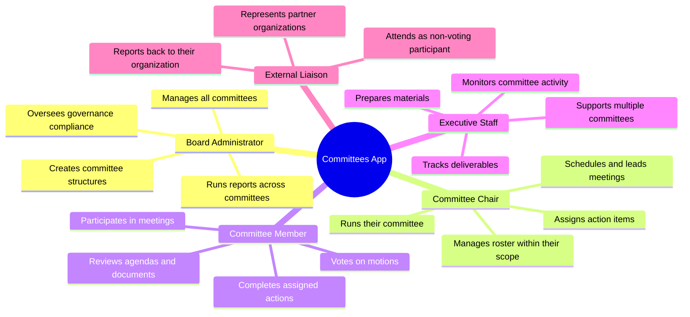

#### Detailed Persona Descriptions

**Board Administrator (Sarah)**
- Responsible for governance across 15+ committees
- Needs visibility into all committee activities
- Manages annual board elections and term transitions
- Creates compliance reports for auditors
- Pain point: Currently maintains a complex spreadsheet with 500+ rows tracking all memberships

**Committee Chair (Michael)**
- Leads a standing committee with 12 members
- Runs monthly meetings with detailed agendas
- Assigns action items and follows up on completion
- Prepares annual reports on committee accomplishments
- Pain point: Spends 3+ hours per meeting on administrative tasks

**Committee Member (Jennifer)**
- Serves on 3 different committees
- Needs to track action items across all committees
- Reviews documents before meetings
- Pain point: Can't remember which committee assigned which task

### 1.4 Real-World Scenarios

#### Scenario 1: Standards Development Organization
A technology standards body has 40+ working groups developing specifications. Each working group:
- Has a chair, vice-chair, and 10-50 members from different companies
- Meets weekly or bi-weekly via video conference
- Tracks ballot votes on draft specifications
- Must maintain audit trails for ISO compliance

#### Scenario 2: Professional Association
A medical professional association has governance committees (Board, Finance, Nominating) plus program committees (Education, Certification, Ethics). They need:
- Annual term management aligned with fiscal year
- Officer succession planning
- Meeting minutes as official records
- Action item tracking across strategic initiatives

#### Scenario 3: Corporate Board Governance
A company's board of directors and advisory committees require:
- Strict access controls on sensitive materials
- Formal voting records
- Document retention policies
- Integration with board portal for materials

---

## 2. Conceptual Model

### 2.1 How Committees, Terms, Roles, and People Fit Together

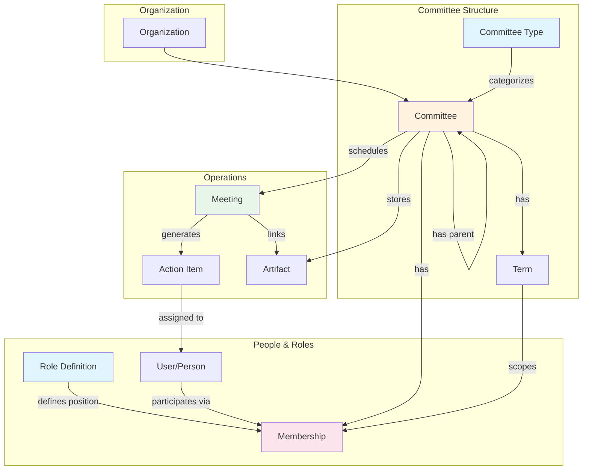

### 2.2 The Membership Triangle

The core data model centers on the **Membership** entity, which connects three dimensions:

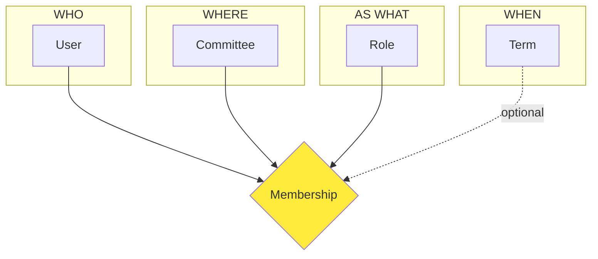

**Key Design Decisions:**

1. **Roles are global, not per-committee**: A "Chair" role means the same thing across all committees. This enables consistent reporting and permission management.

2. **Terms are optional**: Some committees (like ad hoc groups) don't have formal terms. Memberships can exist without being tied to a term.

3. **Users can have multiple memberships**: A person can be Chair of one committee and a Member of another simultaneously.

4. **Historical tracking**: When a membership ends, we record the end date and reason, preserving the audit trail.

### 2.3 Committee Hierarchy

Committees can form hierarchies, enabling complex organizational structures:

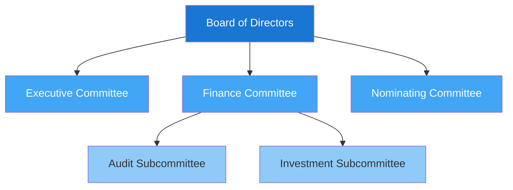

### 2.4 Meeting-Centric Operations

Meetings are the operational heartbeat of committees. Everything flows through meetings:

```mermaid
graph LR
    subgraph "Before"
        A1[Create Meeting]
        A2[Build Agenda]
        A3[Link Documents]
    end

    subgraph "During"
        B1[Record Attendance]
        B2[Discuss Items]
        B3[Capture Notes]
        B4[Create Actions]
    end

    subgraph "After"
        C1[Finalize Minutes]
        C2[Track Actions]
        C3[Link Recording]
    end

    A1 --> A2 --> A3 --> B1 --> B2 --> B3 --> B4 --> C1 --> C2 --> C3

    style A1 fill:#e3f2fd
    style A2 fill:#e3f2fd
    style A3 fill:#e3f2fd
    style B1 fill:#fff3e0
    style B2 fill:#fff3e0
    style B3 fill:#fff3e0
    style B4 fill:#fff3e0
    style C1 fill:#e8f5e9
    style C2 fill:#e8f5e9
    style C3 fill:#e8f5e9
```

---

## 3. Entity Relationship Diagram

### 3.1 Complete ERD

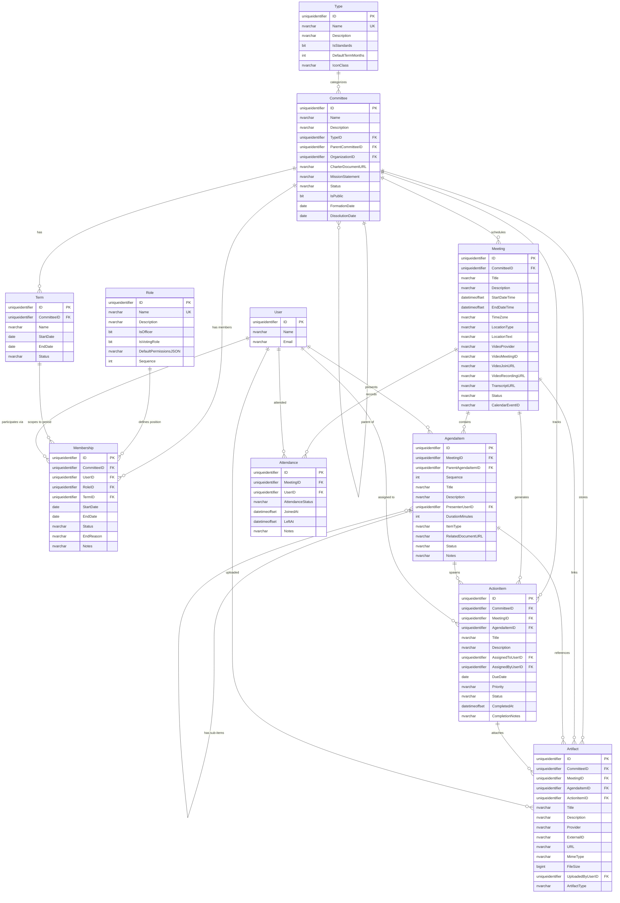

### 3.2 Entity Groupings

| Group | Entities | Purpose |
|-------|----------|---------|
| **Structure** | Type, Committee, Term | Define what committees exist and their lifecycle |
| **People** | Role, Membership, (User from MJ) | Connect people to committees with specific roles |
| **Operations** | Meeting, AgendaItem, Attendance | Run the day-to-day of committee work |
| **Outcomes** | ActionItem, Artifact | Track deliverables and documentation |

---

## 4. System Behavior Sequences

### 4.1 Setting Up a New Committee

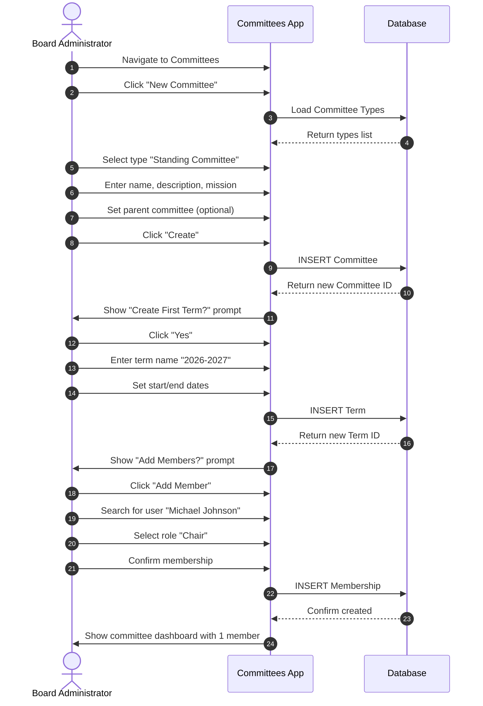

### 4.2 Running a Committee Meeting

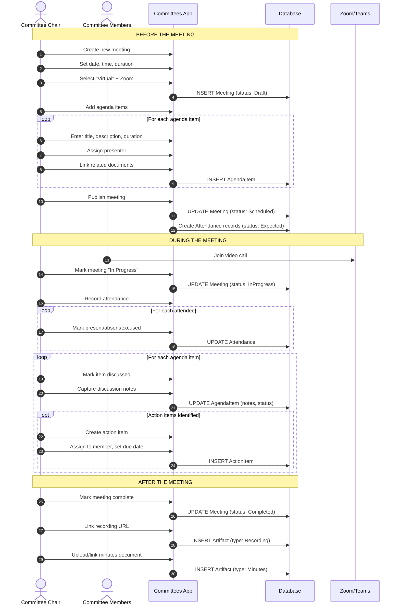

### 4.3 Action Item Lifecycle

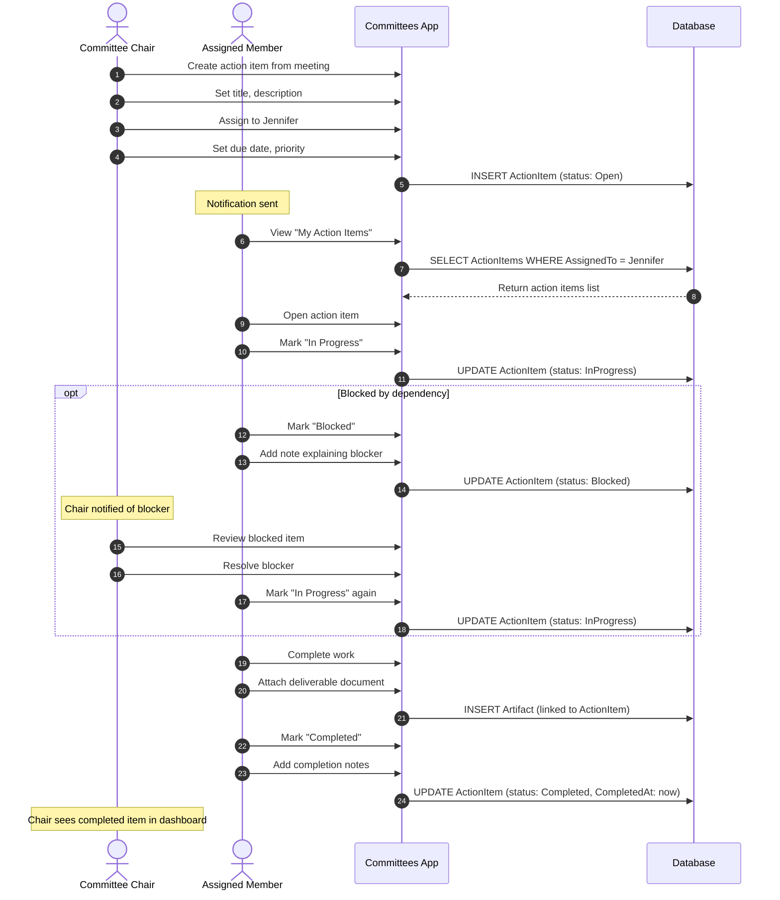

### 4.4 Annual Term Transition

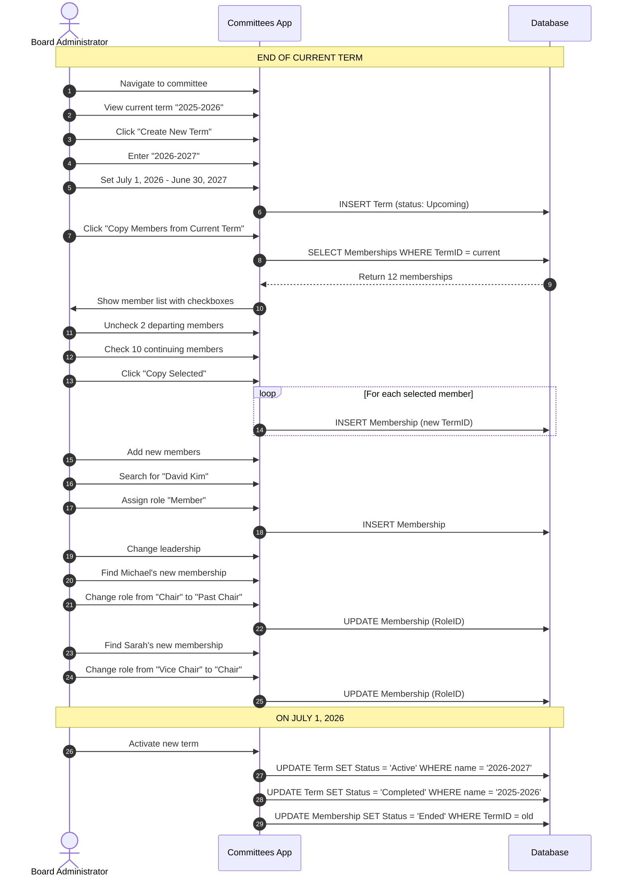

---

## 5. State Diagrams

### 5.1 Committee Status Lifecycle

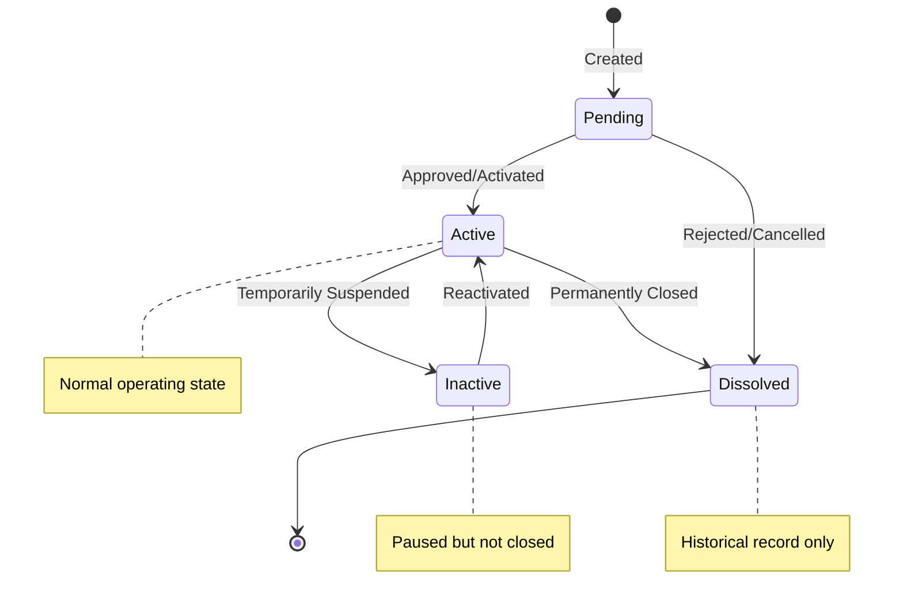

### 5.2 Meeting Status Lifecycle

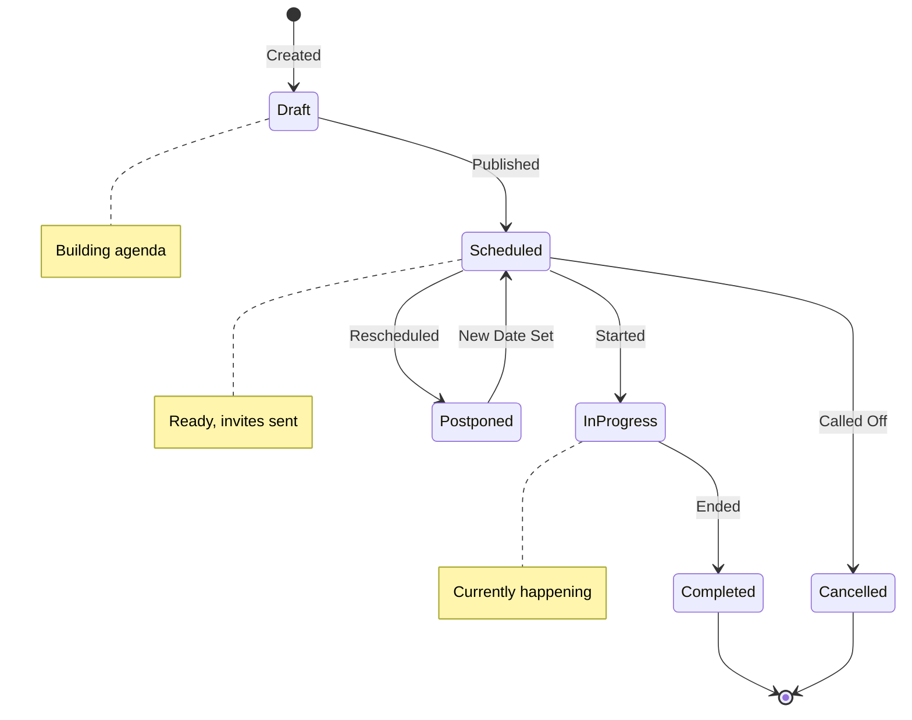

### 5.3 Action Item Status Lifecycle

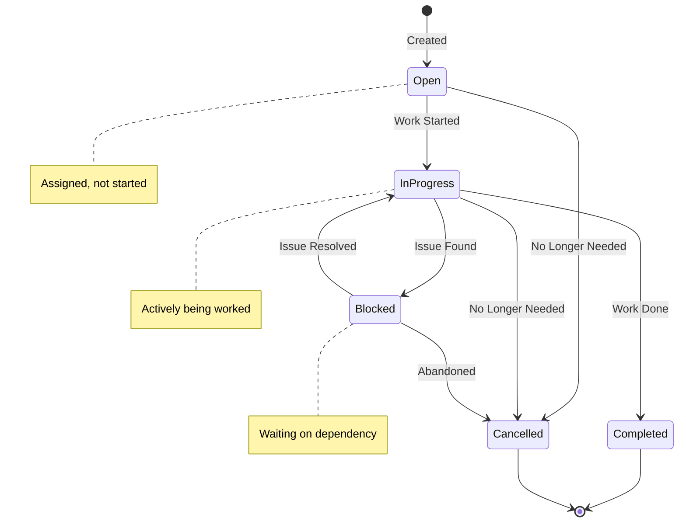

### 5.4 Term Status Lifecycle

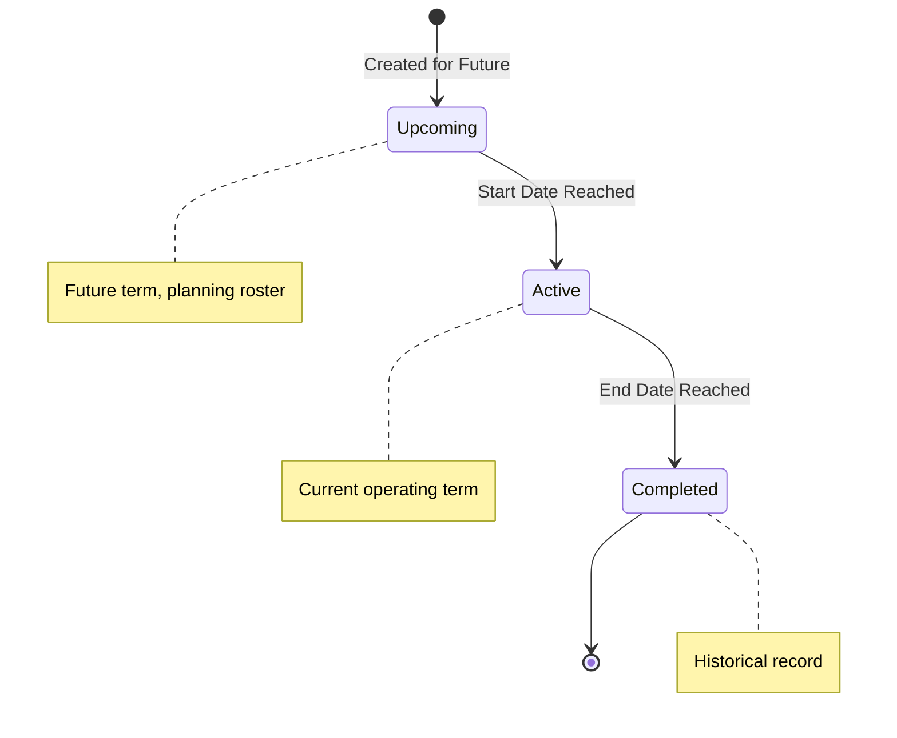

---

## 6. Schema Design

**Schema Name:** `Committees`

All entities use the `Committees` schema. The `__mj_CreatedAt` and `__mj_UpdatedAt` tracking columns are added automatically by MJ CodeGen.

### 6.1 Committee Structure Entities

```sql
CREATE SCHEMA Committees;
GO

-- Committee Types: Board, Standing, Ad Hoc, Workgroup, Standards WG
CREATE TABLE Committees.Type (
    ID UNIQUEIDENTIFIER NOT NULL DEFAULT NEWSEQUENTIALID(),
    Name NVARCHAR(100) NOT NULL,
    Description NVARCHAR(MAX),
    IsStandards BIT NOT NULL DEFAULT 0,
    DefaultTermMonths INT,
    IconClass NVARCHAR(100),
    CONSTRAINT PK_Type PRIMARY KEY (ID),
    CONSTRAINT UQ_Type_Name UNIQUE (Name)
);

-- Core Committee entity
CREATE TABLE Committees.Committee (
    ID UNIQUEIDENTIFIER NOT NULL DEFAULT NEWSEQUENTIALID(),
    Name NVARCHAR(255) NOT NULL,
    Description NVARCHAR(MAX),
    TypeID UNIQUEIDENTIFIER NOT NULL,
    ParentCommitteeID UNIQUEIDENTIFIER,
    OrganizationID UNIQUEIDENTIFIER,
    CharterDocumentURL NVARCHAR(1000),
    MissionStatement NVARCHAR(MAX),
    Status NVARCHAR(50) NOT NULL DEFAULT 'Active',
    IsPublic BIT NOT NULL DEFAULT 1,
    FormationDate DATE,
    DissolutionDate DATE,
    CONSTRAINT PK_Committee PRIMARY KEY (ID),
    CONSTRAINT FK_Committee_Type FOREIGN KEY (TypeID) REFERENCES Committees.Type(ID),
    CONSTRAINT FK_Committee_Parent FOREIGN KEY (ParentCommitteeID) REFERENCES Committees.Committee(ID),
    CONSTRAINT CK_Committee_Status CHECK (Status IN ('Active', 'Inactive', 'Pending', 'Dissolved'))
);

-- Committee Terms (annual or custom periods)
CREATE TABLE Committees.Term (
    ID UNIQUEIDENTIFIER NOT NULL DEFAULT NEWSEQUENTIALID(),
    CommitteeID UNIQUEIDENTIFIER NOT NULL,
    Name NVARCHAR(100) NOT NULL,
    StartDate DATE NOT NULL,
    EndDate DATE,
    Status NVARCHAR(50) NOT NULL DEFAULT 'Active',
    CONSTRAINT PK_Term PRIMARY KEY (ID),
    CONSTRAINT FK_Term_Committee FOREIGN KEY (CommitteeID) REFERENCES Committees.Committee(ID),
    CONSTRAINT CK_Term_Status CHECK (Status IN ('Active', 'Upcoming', 'Completed'))
);
```

### 6.2 Membership & Roles Entities

```sql
-- Role definitions (Chair, Vice Chair, Secretary, Member, Liaison, etc.)
CREATE TABLE Committees.Role (
    ID UNIQUEIDENTIFIER NOT NULL DEFAULT NEWSEQUENTIALID(),
    Name NVARCHAR(100) NOT NULL,
    Description NVARCHAR(MAX),
    IsOfficer BIT NOT NULL DEFAULT 0,
    IsVotingRole BIT NOT NULL DEFAULT 1,
    DefaultPermissionsJSON NVARCHAR(MAX),
    Sequence INT NOT NULL DEFAULT 100,
    CONSTRAINT PK_Role PRIMARY KEY (ID),
    CONSTRAINT UQ_Role_Name UNIQUE (Name)
);

-- Committee membership (links to MJ User entity)
CREATE TABLE Committees.Membership (
    ID UNIQUEIDENTIFIER NOT NULL DEFAULT NEWSEQUENTIALID(),
    CommitteeID UNIQUEIDENTIFIER NOT NULL,
    UserID UNIQUEIDENTIFIER NOT NULL,
    RoleID UNIQUEIDENTIFIER NOT NULL,
    TermID UNIQUEIDENTIFIER,
    StartDate DATE NOT NULL,
    EndDate DATE,
    Status NVARCHAR(50) NOT NULL DEFAULT 'Active',
    EndReason NVARCHAR(100),
    Notes NVARCHAR(MAX),
    CONSTRAINT PK_Membership PRIMARY KEY (ID),
    CONSTRAINT FK_Membership_Committee FOREIGN KEY (CommitteeID) REFERENCES Committees.Committee(ID),
    CONSTRAINT FK_Membership_User FOREIGN KEY (UserID) REFERENCES __mj.[User](ID),
    CONSTRAINT FK_Membership_Role FOREIGN KEY (RoleID) REFERENCES Committees.Role(ID),
    CONSTRAINT FK_Membership_Term FOREIGN KEY (TermID) REFERENCES Committees.Term(ID),
    CONSTRAINT CK_Membership_Status CHECK (Status IN ('Active', 'Pending', 'Ended', 'Suspended'))
);
```

### 6.3 Meeting Entities

```sql
-- Meeting records
CREATE TABLE Committees.Meeting (
    ID UNIQUEIDENTIFIER NOT NULL DEFAULT NEWSEQUENTIALID(),
    CommitteeID UNIQUEIDENTIFIER NOT NULL,
    Title NVARCHAR(255) NOT NULL,
    Description NVARCHAR(MAX),
    StartDateTime DATETIMEOFFSET NOT NULL,
    EndDateTime DATETIMEOFFSET,
    TimeZone NVARCHAR(50) NOT NULL DEFAULT 'America/New_York',
    LocationType NVARCHAR(50) NOT NULL DEFAULT 'Virtual',
    LocationText NVARCHAR(500),
    VideoProvider NVARCHAR(50),
    VideoMeetingID NVARCHAR(255),
    VideoJoinURL NVARCHAR(1000),
    VideoRecordingURL NVARCHAR(1000),
    TranscriptURL NVARCHAR(1000),
    Status NVARCHAR(50) NOT NULL DEFAULT 'Scheduled',
    CalendarEventID NVARCHAR(255),
    CONSTRAINT PK_Meeting PRIMARY KEY (ID),
    CONSTRAINT FK_Meeting_Committee FOREIGN KEY (CommitteeID) REFERENCES Committees.Committee(ID),
    CONSTRAINT CK_Meeting_Status CHECK (Status IN ('Draft', 'Scheduled', 'InProgress', 'Completed', 'Cancelled', 'Postponed')),
    CONSTRAINT CK_Meeting_LocationType CHECK (LocationType IN ('Virtual', 'InPerson', 'Hybrid'))
);

-- Meeting agenda items
CREATE TABLE Committees.AgendaItem (
    ID UNIQUEIDENTIFIER NOT NULL DEFAULT NEWSEQUENTIALID(),
    MeetingID UNIQUEIDENTIFIER NOT NULL,
    ParentAgendaItemID UNIQUEIDENTIFIER,
    Sequence INT NOT NULL,
    Title NVARCHAR(255) NOT NULL,
    Description NVARCHAR(MAX),
    PresenterUserID UNIQUEIDENTIFIER,
    DurationMinutes INT,
    ItemType NVARCHAR(50) NOT NULL DEFAULT 'Discussion',
    RelatedDocumentURL NVARCHAR(1000),
    Status NVARCHAR(50) NOT NULL DEFAULT 'Pending',
    Notes NVARCHAR(MAX),
    CONSTRAINT PK_AgendaItem PRIMARY KEY (ID),
    CONSTRAINT FK_AgendaItem_Meeting FOREIGN KEY (MeetingID) REFERENCES Committees.Meeting(ID),
    CONSTRAINT FK_AgendaItem_Parent FOREIGN KEY (ParentAgendaItemID) REFERENCES Committees.AgendaItem(ID),
    CONSTRAINT FK_AgendaItem_Presenter FOREIGN KEY (PresenterUserID) REFERENCES __mj.[User](ID),
    CONSTRAINT CK_AgendaItem_Type CHECK (ItemType IN ('Information', 'Discussion', 'Action', 'Vote', 'Report', 'Other')),
    CONSTRAINT CK_AgendaItem_Status CHECK (Status IN ('Pending', 'Discussed', 'Tabled', 'Completed', 'Skipped'))
);

-- Meeting attendance
CREATE TABLE Committees.Attendance (
    ID UNIQUEIDENTIFIER NOT NULL DEFAULT NEWSEQUENTIALID(),
    MeetingID UNIQUEIDENTIFIER NOT NULL,
    UserID UNIQUEIDENTIFIER NOT NULL,
    AttendanceStatus NVARCHAR(50) NOT NULL DEFAULT 'Expected',
    JoinedAt DATETIMEOFFSET,
    LeftAt DATETIMEOFFSET,
    Notes NVARCHAR(500),
    CONSTRAINT PK_Attendance PRIMARY KEY (ID),
    CONSTRAINT FK_Attendance_Meeting FOREIGN KEY (MeetingID) REFERENCES Committees.Meeting(ID),
    CONSTRAINT FK_Attendance_User FOREIGN KEY (UserID) REFERENCES __mj.[User](ID),
    CONSTRAINT CK_Attendance_Status CHECK (AttendanceStatus IN ('Expected', 'Present', 'Absent', 'Excused', 'Partial')),
    CONSTRAINT UQ_Attendance UNIQUE (MeetingID, UserID)
);
```

### 6.4 Action Items & Artifacts

```sql
-- Action items (tasks assigned from meetings or committees)
CREATE TABLE Committees.ActionItem (
    ID UNIQUEIDENTIFIER NOT NULL DEFAULT NEWSEQUENTIALID(),
    CommitteeID UNIQUEIDENTIFIER NOT NULL,
    MeetingID UNIQUEIDENTIFIER,
    AgendaItemID UNIQUEIDENTIFIER,
    Title NVARCHAR(255) NOT NULL,
    Description NVARCHAR(MAX),
    AssignedToUserID UNIQUEIDENTIFIER NOT NULL,
    AssignedByUserID UNIQUEIDENTIFIER,
    DueDate DATE,
    Priority NVARCHAR(20) NOT NULL DEFAULT 'Medium',
    Status NVARCHAR(50) NOT NULL DEFAULT 'Open',
    CompletedAt DATETIMEOFFSET,
    CompletionNotes NVARCHAR(MAX),
    CONSTRAINT PK_ActionItem PRIMARY KEY (ID),
    CONSTRAINT FK_ActionItem_Committee FOREIGN KEY (CommitteeID) REFERENCES Committees.Committee(ID),
    CONSTRAINT FK_ActionItem_Meeting FOREIGN KEY (MeetingID) REFERENCES Committees.Meeting(ID),
    CONSTRAINT FK_ActionItem_AgendaItem FOREIGN KEY (AgendaItemID) REFERENCES Committees.AgendaItem(ID),
    CONSTRAINT FK_ActionItem_AssignedTo FOREIGN KEY (AssignedToUserID) REFERENCES __mj.[User](ID),
    CONSTRAINT FK_ActionItem_AssignedBy FOREIGN KEY (AssignedByUserID) REFERENCES __mj.[User](ID),
    CONSTRAINT CK_ActionItem_Priority CHECK (Priority IN ('Low', 'Medium', 'High', 'Critical')),
    CONSTRAINT CK_ActionItem_Status CHECK (Status IN ('Open', 'InProgress', 'Blocked', 'Completed', 'Cancelled'))
);

-- External artifact links (documents, files, etc.)
CREATE TABLE Committees.Artifact (
    ID UNIQUEIDENTIFIER NOT NULL DEFAULT NEWSEQUENTIALID(),
    CommitteeID UNIQUEIDENTIFIER,
    MeetingID UNIQUEIDENTIFIER,
    AgendaItemID UNIQUEIDENTIFIER,
    ActionItemID UNIQUEIDENTIFIER,
    Title NVARCHAR(255) NOT NULL,
    Description NVARCHAR(MAX),
    Provider NVARCHAR(50) NOT NULL,
    ExternalID NVARCHAR(500),
    URL NVARCHAR(2000) NOT NULL,
    MimeType NVARCHAR(100),
    FileSize BIGINT,
    UploadedByUserID UNIQUEIDENTIFIER,
    ArtifactType NVARCHAR(50) NOT NULL DEFAULT 'Document',
    CONSTRAINT PK_Artifact PRIMARY KEY (ID),
    CONSTRAINT FK_Artifact_Committee FOREIGN KEY (CommitteeID) REFERENCES Committees.Committee(ID),
    CONSTRAINT FK_Artifact_Meeting FOREIGN KEY (MeetingID) REFERENCES Committees.Meeting(ID),
    CONSTRAINT FK_Artifact_AgendaItem FOREIGN KEY (AgendaItemID) REFERENCES Committees.AgendaItem(ID),
    CONSTRAINT FK_Artifact_ActionItem FOREIGN KEY (ActionItemID) REFERENCES Committees.ActionItem(ID),
    CONSTRAINT FK_Artifact_UploadedBy FOREIGN KEY (UploadedByUserID) REFERENCES __mj.[User](ID),
    CONSTRAINT CK_Artifact_Provider CHECK (Provider IN ('GoogleDrive', 'SharePoint', 'Box', 'OneDrive', 'Dropbox', 'URL')),
    CONSTRAINT CK_Artifact_Type CHECK (ArtifactType IN ('Document', 'Spreadsheet', 'Presentation', 'Minutes', 'Agenda', 'Recording', 'Transcript', 'Image', 'Other'))
);
```

---

## 7. Core Entity Summary

| Entity Name | Table | Description |
|-------------|-------|-------------|
| Types | Committees.Type | Board, Standing, Ad Hoc, Workgroup |
| Committees | Committees.Committee | Core committee records |
| Terms | Committees.Term | Annual/custom term periods |
| Roles | Committees.Role | Chair, Vice Chair, Member, etc. |
| Memberships | Committees.Membership | User-committee assignments |
| Meetings | Committees.Meeting | Meeting records |
| Agenda Items | Committees.AgendaItem | Structured agendas |
| Attendance | Committees.Attendance | Who attended |
| Action Items | Committees.ActionItem | Tasks and assignments |
| Artifacts | Committees.Artifact | Document/file links |

---

## 8. Design Principles

- **Metadata-driven**: All configuration in the database, not code
- **Link-first integration**: References to external systems (Zoom, Google Docs, SharePoint), not recreation
- **Entity-centric**: Leverages MJ's canonical entities (Users, Organizations) rather than duplicating
- **Open-core**: Free core is fully functional; premium adds workflow automation and AI (future phases)

---

## 9. Migration Files

Single migration file: `migrations/V202601220001__Committees_Schema_and_Tables.sql`

Contains:
1. `CREATE SCHEMA Committees`
2. 10 `CREATE TABLE` statements
3. Extended properties via `sp_addextendedproperty` for:
   - Schema description
   - Table descriptions
   - Column descriptions (excluding ID and FK columns)
4. Seed data for Types and Roles

**Note:** `__mj_CreatedAt` and `__mj_UpdatedAt` columns are added automatically by MJ CodeGen.

---

## 10. Seed Data

```sql
-- Default Committee Types
INSERT INTO Committees.Type (Name, Description, IsStandards, DefaultTermMonths, IconClass) VALUES
('Board of Directors', 'Governing board with fiduciary responsibility', 0, 12, 'fa-solid fa-landmark'),
('Standing Committee', 'Permanent committee with ongoing responsibilities', 0, 12, 'fa-solid fa-users'),
('Ad Hoc Committee', 'Temporary committee for specific purpose', 0, NULL, 'fa-solid fa-clock'),
('Workgroup', 'Task-focused group with defined deliverables', 0, NULL, 'fa-solid fa-briefcase'),
('Standards Working Group', 'Committee developing standards or specifications', 1, NULL, 'fa-solid fa-file-contract');

-- Default Roles
INSERT INTO Committees.Role (Name, Description, IsOfficer, IsVotingRole, Sequence) VALUES
('Chair', 'Leads the committee and runs meetings', 1, 1, 10),
('Vice Chair', 'Supports chair and leads in their absence', 1, 1, 20),
('Secretary', 'Records minutes and manages documentation', 1, 1, 30),
('Member', 'Voting member of the committee', 0, 1, 100),
('Non-Voting Member', 'Participates but does not vote', 0, 0, 110),
('Liaison', 'Represents another group or organization', 0, 0, 120),
('Advisor', 'Provides expertise without membership', 0, 0, 130);
```

---

## 11. Phase 1 Deliverables

1. Database migration with core entities (10 tables)
2. Extended properties migration with descriptions
3. `@memberjunction/committees-core` package
4. `@memberjunction/ng-committees` Angular components
5. Application metadata for MJ Explorer
6. Basic CRUD for committees, memberships, meetings
7. Document linking (URL-based)

---

## 12. Future Phases

| Phase | Focus | Key Features |
|-------|-------|--------------|
| **Phase 2** | Enhanced Core | Committee dashboard, meeting templates, email notifications |
| **Phase 3** | Premium - Standards | Workflow stages, balloting/voting, calendar integration |
| **Phase 4** | Premium - AI | Transcript processing, AI-generated minutes, analytics |

---

*Document created for Blue Cypress / MemberJunction architecture planning.*
